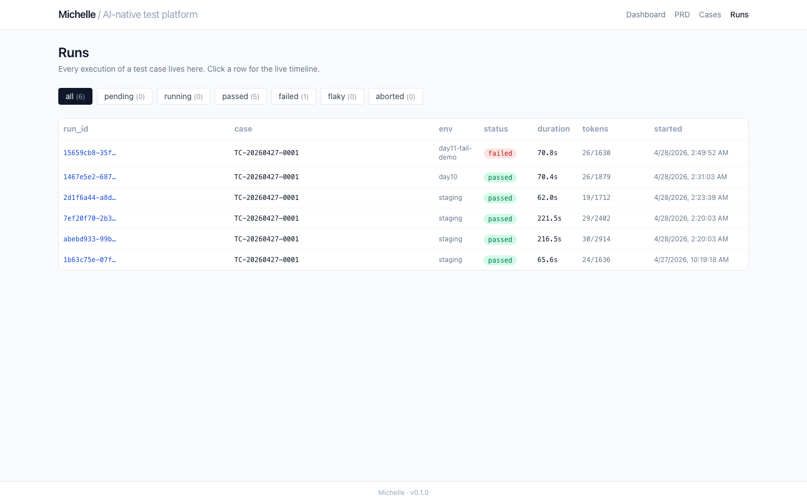

# Michelle

[](https://github.com/yy757303533/michelle/actions/workflows/ci.yml)


> **AI-native Web 测试平台** · PRD → AI 生成用例 → 人工 review → 一键执行 → AI 诊断 → 沉淀闭环
>
> *not a tool, an agent that gets smarter the more it runs.*

📖 [5-min walkthrough](docs/STORY.md) · 🎬 [demo video](docs/day12-demo/walkthrough.webm) · 📋 [PRD](docs/prd.md) · 🏗 [ADRs](docs/adr/) · 🔬 [lessons learned](docs/lessons-learned.md) · 🎤 [interview talk track](docs/INTERVIEW.md)

---

## What it does in one screenshot


Michelle ran one of the 12 cases it had auto-generated from its own PRD.
The case failed (deliberately wrong password). The `run.failed` hook fired,
diagnose_v1 was rendered with the trace + screenshot + step error, MiniMax
returned `data_issue` with confidence 0.80 and a one-sentence fix. The
human clicked **confirmed**, the failure signature got folded into the
pattern library, and the next time a similar failure surfaces it's matched
in 50ms — no LLM call needed.

That's the compound-engineering loop. Every confirmed failure makes the next
one cheaper.

---

## Pillars

1. **Agent-native parity**. Anything the Web UI can do, an agent can too — REST API, Claude Code Skill, Michelle's own MCP server.
2. **AI at the right layers**. Generation (PRD → cases) and diagnosis (failure → root cause). Execution itself is deterministic via [`@playwright/mcp`](https://github.com/microsoft/playwright-mcp).
3. **provider-agnostic LLM gateway**. 10 channels (Claude / Codex / Flywheel / Kimi / Qwen / GLM / Gemini / DeepSeek / MiniMax / arbitrary OpenAI-compatible relay) behind one `BaseChatClient`. Auto-fallback on RateLimit / Quota / Timeout.
4. **Three layers of observability**. OpenTelemetry (infra) + Event Catalog (business) + AI diagnosis (read-the-trace-for-you, on top).

---

## Tour

| Page | Screenshot |
|---|---|
| **Dashboard** — live counts + 9-provider status | [](docs/day12-demo/dashboard.png) |
| **PRD ingest** — paste markdown, see chapter diff vs prev version, generate per-chapter | [](docs/day12-demo/prd.png) |
| **Cases** — review queue, batch approve/reject, inline edit (tracked in `manual_edited_fields`) | [](docs/day12-demo/cases.png) |
| **Runs** — newest-first, filterable by status | [](docs/day12-demo/runs.png) |
| **Run timeline** — every tool call + thumbnail screenshot + lightbox + URL trail | [](docs/day12-demo/run-detail.png) |
| **AI diagnosis** — category / confidence / reasoning / fix + sediment matches | [](docs/day12-demo/diagnosis.png) |

---

## Tech stack

| Layer | Choice | Why |
|---|---|---|
| Backend | Python 3.12+ · FastAPI · SQLModel + Alembic · structlog · OpenTelemetry · pytest | LLM ecosystem is best in Python; async-first |
| Frontend | Vite + React 19 + TypeScript · TanStack Router/Query · Tailwind · shadcn-ui | SPA matches separated backend; no Next.js bloat needed |
| Execution | `claude -p --mcp-config ours` subprocess + `@playwright/mcp` (ARIA tree) | Deterministic, demo-stable, ~100ms/step (vs 1.8s for vision-LLM-per-step) |
| Storage | SQLite + local FS (MVP) · Postgres + MinIO (Phase 2) | Zero-ops MVP, drop-in upgrade path |
| LLM Gateway | provider-agnostic + 10 channels + auto-fallback | Demo never blocks on rate-limit |

## LLM Gateway — 10 channels

| pri | provider | type | enable |
|---:|---|---|---|
| 10 | **claude-cli** | subscription CLI(主) | `claude` 已登录 |
| 15 | **codex-cli** | subscription CLI | `codex` + `CODEX_ENABLED=true` |
| 20 | **flywheel** | OpenAI-compatible proxy(GPT-5.5 / Opus 4.7 / etc) | `FLYWHEEL_TOKEN` |
| 25 | **deepseek** | OpenAI-compatible | `DEEPSEEK_API_KEY` |
| 30 | **qwen** | OpenAI-compatible (DashScope) | `QWEN_API_KEY` |
| 35 | **glm** | OpenAI-compatible (智谱) | `GLM_API_KEY` |
| 40 | **kimi** | OpenAI-compatible (Moonshot) | `KIMI_API_KEY` |
| 45 | **gemini** | OpenAI-compatible | `GEMINI_API_KEY` |
| 50 | **minimax** | native protocol + multimodal | `MINIMAX_API_KEY` |
| 60 | **relay** | any OpenAI-compatible (OneAPI/NewAPI/OpenRouter…) | `RELAY_API_KEY` + `RELAY_BASE_URL` + `RELAY_MODEL` |

```python
result = await gateway.chat(
    "your prompt",
    prompt_version="case_gen_v1",
    prefer="deepseek",      # optional
    skip=["minimax"],       # optional
    image=screenshot_bytes, # optional, multimodal providers only
    json_mode=True,         # optional
)
```

Day-11's diagnoser uses this. When a screenshot is attached, the gateway
auto-routes to a vision-capable provider (minimax/kimi/gemini/...) because
Claude CLI's `-p` mode can't relay images without a session token. Other
calls hit Claude first; if Claude rate-limits, the next provider takes over
transparently.

---

## Agent-native triple surface

The same `execute_case` capability is reachable three ways:

| Surface | For | Example |
|---|---|---|
| **REST** `/api/...` | Web UI / any HTTP client | `curl -X POST /api/runs '{"case_ids":["TC-..."]}'` |
| **Claude Code Skills** `.claude/skills/` | Claude Code terminal users | `/michelle-run TC-20260427-0001` |
| **MCP server** `backend/app/mcp/` | other AI clients (Cursor / Windsurf / custom agents) | `michelle.execute_case(case_id="TC-...")` |

Anything a human can do, an agent can too.

---

## Quick start

```bash
# 1. Install deps + verify CLI tools (claude / npx / playwright chromium / docker not needed)
make setup

# 2. Copy env template (works empty — Claude subscription is enough)
cp .env.example .env

# 3. Bring up backend (:8000) + frontend (:5173)
make dev
```

Open `http://localhost:5173`. Upload a PRD on the PRD page, generate cases,
approve, ▶ Run. When something fails, the AI diagnose button on the run
page wires the rest.

End-to-end smoke scripts (real LLM, real browser, real ZStack target):

```bash
cd backend
uv run python ../scripts/day2_smoke.py            # claude + @playwright/mcp drives ZStack login
uv run python ../scripts/day4_dogfood.py          # generate cases from Michelle's own PRD
uv run python ../scripts/day7_visual_smoke.py     # screenshot every page
uv run python ../scripts/day12_demo_capture.py    # full walkthrough video
```

---

## Project layout

```
backend/
  app/
    api/            REST: prd, cases, runs, projects, diagnosis, llm
    services/       prd_parser, prd_diff, case_generator, case_versioning,
                    run_orchestrator, report_html, diagnoser, pattern_store
    agent/          claude_runner, mcp_config, trace_parser, hooks
    llm/            provider-agnostic gateway + 10 clients + versioned prompts/
    mcp/            Michelle's own MCP server — 6 tools
    obs/            structlog + OTel + Event Catalog
    models/         Project / PRD / TestCase / Run / StepEvent / Diagnosis / Pattern
    storage/        local FS (MVP) — interface ready for MinIO
  alembic/          schema migrations (initial revision covers all 7 tables)
  tests/            152 unit tests, 1 integration smoke (gated by env)
frontend/           Vite + React 19 + TS + TanStack Router/Query + Tailwind
.claude/
  skills/           michelle-run / michelle-diagnose / michelle-suggest
  agents/           michelle-diagnoser / michelle-reviewer
vendor/
  webtest-mcp/      forked from author's prior project — Excel schema + HTML report
docs/
  prd.md            1198-line PRD (Michelle's own, dogfooded)
  STORY.md          5-minute interview walkthrough
  lessons-learned.md   honest retrospective
  adr/              5 architecture decision records
  day*-findings.md  daily implementation diaries
  day7-screens/     visual smoke screenshots
  day10-screens/    trace viewer + lightbox demo
  day11-sample/     real diagnosis JSON
  day12-demo/       full-flow screenshots + walkthrough.webm
scripts/            re-runnable end-to-end smokes
CLAUDE.md           orientation for any future Claude Code session
```

---

## Progress

| Day | What | Tests |
|---|---|---|
| 1 | Project skeleton + agent-native surface | 6 |
| 2 | claude + `@playwright/mcp` drives ZStack login | 10 |
| 3 | LLM Gateway with auto-fallback | 34 |
| 4 | PRD ingest + AI case generation + dogfood (12 cases) | 59 |
| 5 | Alembic + HTML report generator | 74 |
| 6 | Run Orchestrator end-to-end + 10 LLM providers | 104 |
| 7 | Frontend integration polish + visual smoke | 104 |
| 8 | Review workflow (manual edit, bulk, stale, version protection) | 120 |
| 9 | Batch concurrency + retry + heuristic classification | 128 |
| 10 | Trace Viewer with screenshot timeline + lightbox | 135 |
| 11 | **AI diagnosis + sediment loop** ← compound engineering closes here | 152 |
| 12 | Demo capture + README + STORY + lessons-learned | 152 |
| 13 | (planned) interview talk track |  |
| 14 | (planned) buffer |  |

---

## Acknowledgements

- **`@playwright/mcp`** — Microsoft's Playwright MCP server (execution engine)
- **[webtest-mcp-server](https://github.com/yy757303533/webtest-mcp-server)** — author's prior project, forked into `vendor/`
- **Compound Engineering** — Every team (Dan Shipper, Kieran Klaassen) for the framing
- **OpenTelemetry / Logfire** — observability standards

## License

TBD.
