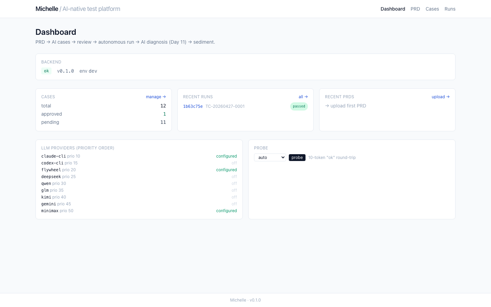
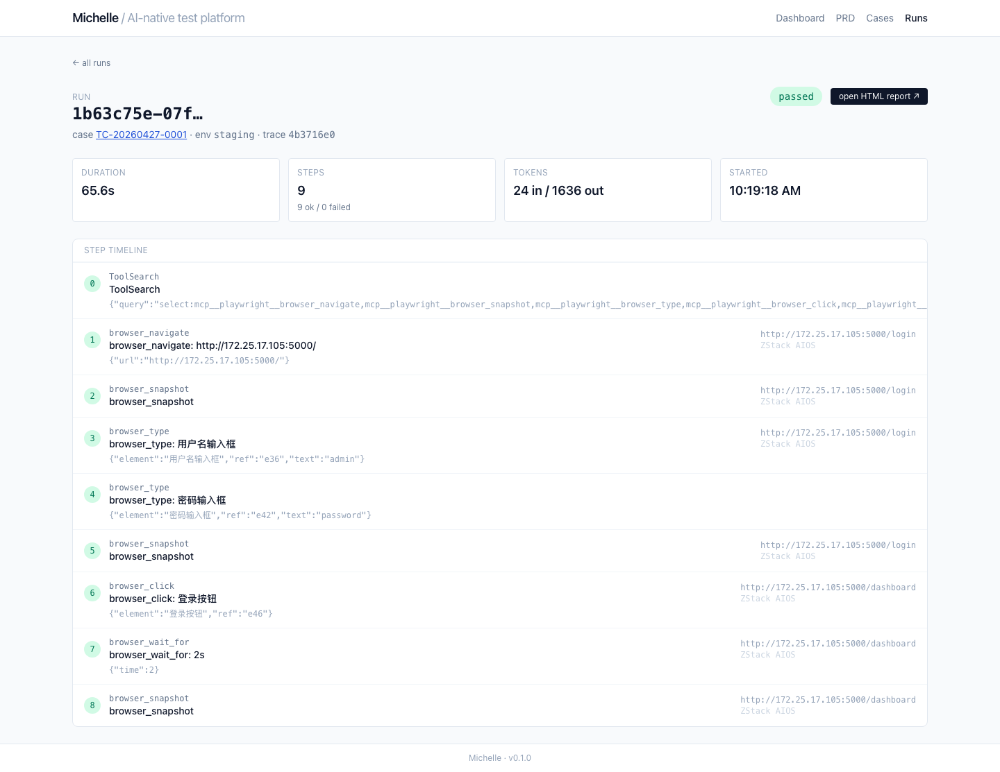
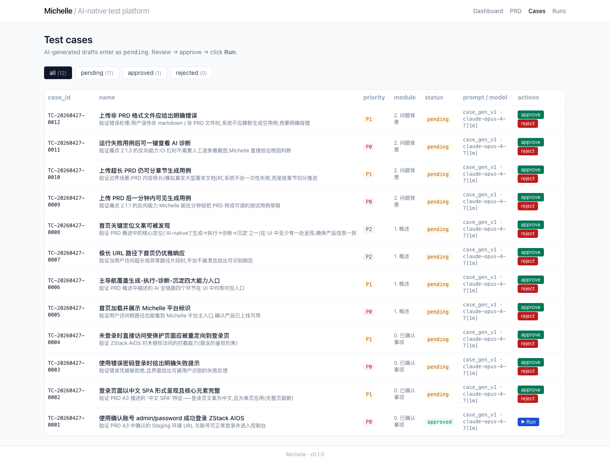
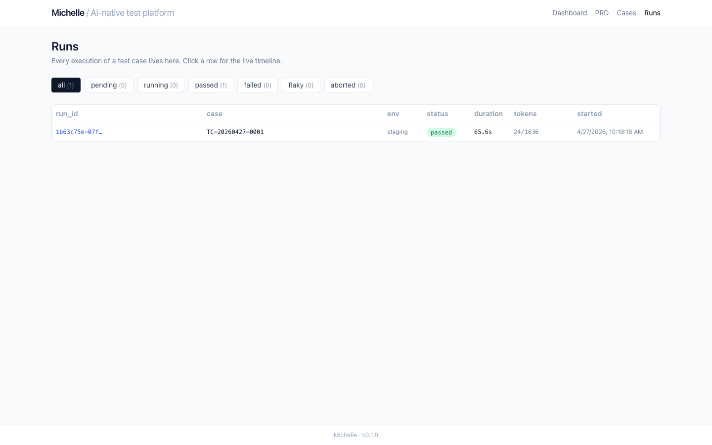

# Michelle

> **AI-native Web 测试平台**:PRD → AI 生成用例 → 人工 review → 一键执行 → AI 诊断 → 沉淀闭环。

设计文档:[`docs/prd.md`](docs/prd.md) · 架构决策:[`docs/adr/`](docs/adr/) · 实测沉淀:[`docs/day*-findings.md`](docs/)

---

## 它不是一个测试工具,是个会自己变聪明的平台

不是把 AI 当代码生成器,是把 AI 贯穿全流程:

- **生成**:Claude 读 PRD,产出自然语言形式的用例(Day 4 dogfood:从 Michelle 自己的 PRD 生成 12 条用例)
- **执行**:Claude session + `@playwright/mcp`(Microsoft 官方 ARIA tree)驱动浏览器(Day 6 实测:65s 端到端登录 ZStack AIOS,9 个 tool call,$0)
- **诊断**:用例失败时 AI 读 trace + 截图,输出根因 + 修复建议(Day 11)
- **沉淀**:每次失败让平台更准 —— `compound engineering` 闭环(Day 11)

## 截图(Day 7 实测)

| 页面 | 截图 |
|------|------|
| Dashboard | [](docs/day7-screens/dashboard.png) |
| Run 时间线 | [](docs/day7-screens/run-detail.png) |
| 用例列表 | [](docs/day7-screens/cases.png) |
| Runs 列表 | [](docs/day7-screens/runs.png) |

---

## 技术栈

| 层 | 选型 |
|---|---|
| **后端** | Python 3.12+ / FastAPI / SQLModel + Alembic / structlog / OpenTelemetry / pytest |
| **前端** | Vite + React 19 + TypeScript / TanStack Router + Query / Tailwind / shadcn-ui |
| **执行引擎** | `claude -p --mcp-config <ours>` 子进程 + `@playwright/mcp` (ARIA tree) |
| **数据** | SQLite + 本地文件系统(MVP)/ Postgres + MinIO(Phase 2) |
| **可观测性** | OpenTelemetry + Logfire(可选) |

## LLM Gateway — 10 通道 provider-agnostic

每个 provider 实现 `BaseChatClient`;Gateway 自动按优先级路由,撞 RateLimit / Quota / Timeout 时透明 fallback,撞 Auth / ResponseFormat 时直接抛错。**任何一个 provider 都能单独用,也能任意组合**。

| 优先级 | Provider | 类型 | 启用条件 |
|---:|---|---|---|
| 10 | **claude-cli** | subscription CLI(主路径) | `claude` 在 PATH + 已登录 |
| 15 | **codex-cli** | subscription CLI | `codex` 在 PATH + `CODEX_ENABLED=true` |
| 20 | **flywheel** | OpenAI-兼容代理 | `FLYWHEEL_TOKEN` |
| 25 | **deepseek** | OpenAI-兼容 | `DEEPSEEK_API_KEY` |
| 30 | **qwen** | OpenAI-兼容 (DashScope) | `QWEN_API_KEY` |
| 35 | **glm** | OpenAI-兼容 (智谱) | `GLM_API_KEY` |
| 40 | **kimi** | OpenAI-兼容 (Moonshot) | `KIMI_API_KEY` |
| 45 | **gemini** | OpenAI-兼容 | `GEMINI_API_KEY` |
| 50 | **minimax** | 原生协议 + vision 多模态 | `MINIMAX_API_KEY` |
| 60 | **relay** | 任意 OpenAI-兼容中转(OneAPI/NewAPI/OpenRouter…) | `RELAY_API_KEY` + `RELAY_BASE_URL` + `RELAY_MODEL` |

**调用约定**(完全统一):

```python
from app.llm import get_gateway

gateway = get_gateway()
result = await gateway.chat(
    "your prompt",
    prompt_version="case_gen_v1",
    prefer="deepseek",      # optional
    skip=["minimax"],       # optional
    image=screenshot_bytes, # optional, multimodal providers only
    json_mode=True,         # optional
)
print(result.text, result.input_tokens, result.output_tokens, result.provider)
```

---

## Agent-native 三层接口

任何人能做的,任何 agent 也能做(REST / Skill / MCP 三层等价):

| 层 | 用途 | 谁用 |
|----|------|-----|
| **REST API** `/api/...` | 标准 HTTP 接口 | Web UI / 任何 HTTP 客户端 |
| **Claude Code Skills** `.claude/skills/` | `/michelle-run` `/michelle-diagnose` `/michelle-suggest` | Claude Code 终端用户 |
| **MCP Server** `backend/app/mcp/` | `michelle.execute_case` 等 6 个工具 | 任何 MCP 客户端(Cursor、Windsurf、自建 agent)|

---

## 快速开始

```bash
# 1. 装依赖 + 验证 CLI 工具(claude / npx / playwright chromium 等)
make setup

# 2. 复制环境模板,把你想用的 provider 的 key 填进去(全空也能跑,只用 Claude 订阅)
cp .env.example .env

# 3. 起前后端(:8000 + :5173)
make dev

# 4. 浏览器打开 http://localhost:5173
#    上传 PRD → 选章节生成用例 → review → ▶ Run → 看实时 Run 时间线
```

可选的端到端烟测脚本(用真实 LLM):

```bash
cd backend && uv run python ../scripts/day2_smoke.py    # claude + @playwright/mcp 跑通登录 ZStack
cd backend && uv run python ../scripts/day4_dogfood.py  # 用 Michelle 自己的 PRD 生成 12 条用例
cd backend && uv run python ../scripts/day7_visual_smoke.py  # 截全部 5 页 → docs/day7-screens/
```

---

## 项目结构

```
backend/
  app/
    api/             REST 路由(prd / cases / runs / projects / diagnosis / llm)
    services/        prd_parser, prd_diff, case_generator, run_orchestrator, report_html
    agent/           claude_runner, mcp_config, trace_parser, hooks
    llm/             provider-agnostic gateway + 10 providers + versioned prompts/
    mcp/             Michelle 自身的 MCP server,暴露 6 个工具
    obs/             structlog + OTel + Event Catalog
    models/          Project / PRD / TestCase / Run / StepEvent / Diagnosis / Pattern
  alembic/           初始 migration + env.py(async)
  tests/             104 个 unit test + integration smoke
frontend/
  src/routes/        TanStack Router file-based(__root / index / prd / cases / runs / runs.$id / diagnosis.$id)
.claude/
  skills/            michelle-run / michelle-diagnose / michelle-suggest
  agents/            michelle-diagnoser / michelle-reviewer
vendor/
  webtest-mcp/       Fork 自作者 prior 项目,提供 Excel schema + HTML 报告生成思路
docs/
  prd.md             1300+ 行 PRD(Michelle 自己,被自己 dogfood)
  adr/               5 篇架构决策记录
  day*-findings.md   每天的实测沉淀
  day7-screens/      可点放大的页面截图
```

---

## 进度

| Day | 完成度 | 内容 |
|-----|---|---|
| 1 | ✅ | 项目骨架 + agent-native 三层接口 |
| 2 | ✅ | claude + `@playwright/mcp` 登录 ZStack 闸门验证 |
| 3 | ✅ | LLM Gateway provider-agnostic + fallback 链 |
| 4 | ✅ | PRD ingest + 12 条 dogfood 用例 |
| 5 | ✅ | Alembic 迁移 + HTML 报告渲染 |
| 6 | ✅ | Run Orchestrator 端到端 + 10 个 LLM provider |
| 7 | ✅ | 前端联调 + Runs 列表 + Dashboard 实时 widget + 视觉烟测 |
| 8 | 待 | Review 工作流 + 用例版本化 + 人工编辑保护 |
| 9 | 待 | 多 case 批跑 + 失败分类 |
| 10 | 待 | Trace Viewer 失败回放 |
| 11 | 待 | **AI 诊断** + 沉淀模式库 + 黄金回归集 |
| 12 | 待 | Demo 视频 + ADR 完善 |
| 13 | 待 | 面试话术 |
| 14 | 待 | Buffer |

---

## 致谢

- **`@playwright/mcp`** — Microsoft 官方 Playwright MCP server(执行引擎)
- **webtest-mcp-server** — 作者 prior 项目,fork 进 `vendor/` 作执行内核 (https://github.com/yy757303533/webtest-mcp-server)
- **Compound Engineering** 理念 — Every 团队 (Dan Shipper / Kieran Klaassen)
- **OpenTelemetry / Logfire / Langfuse** — 可观测性工具链

## License

TBD(暂未决定)
