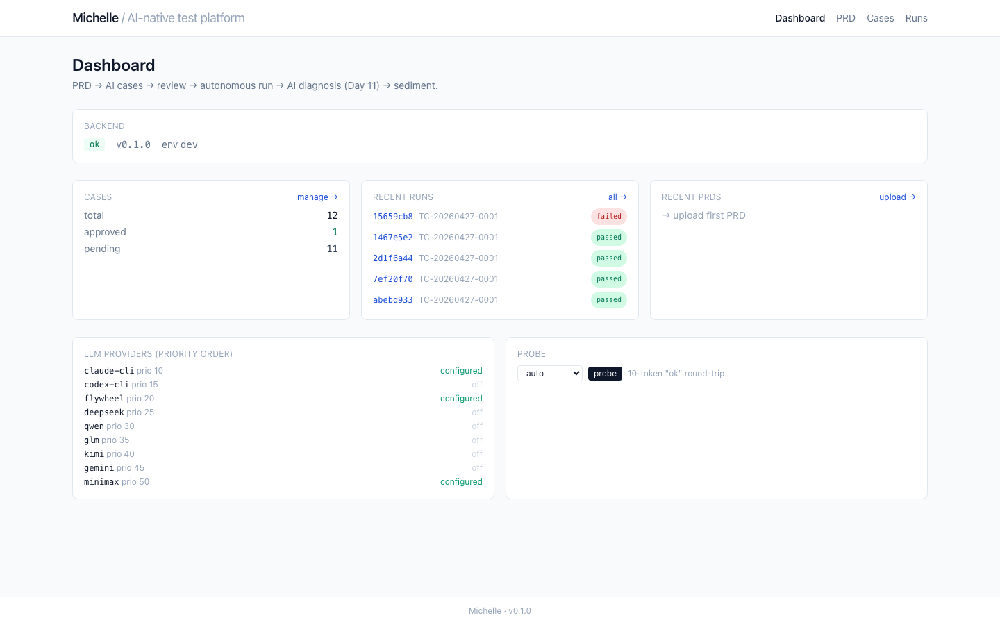
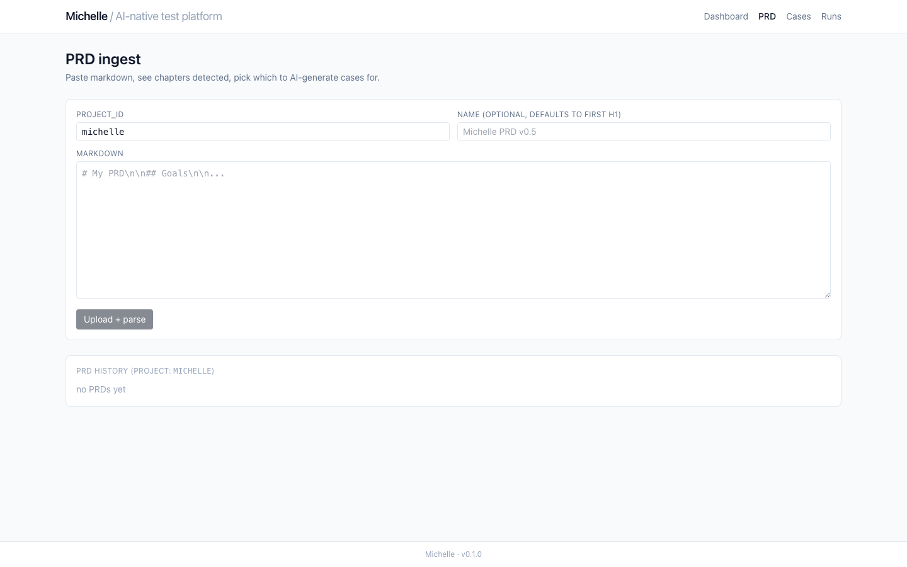
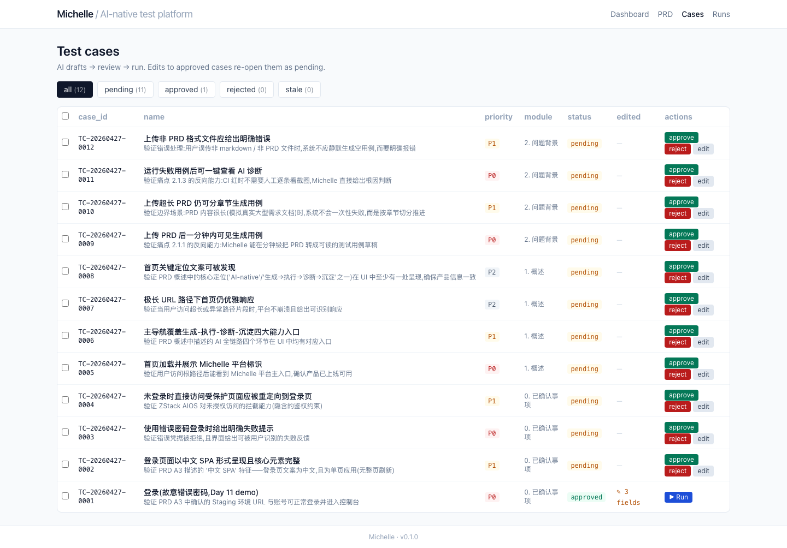
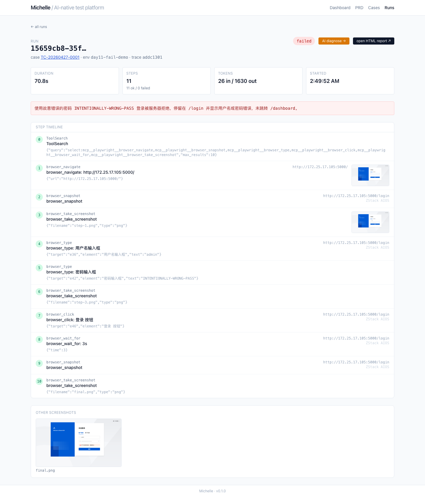
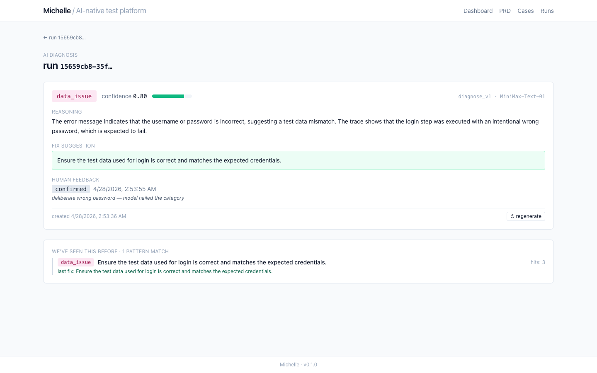

# Michelle — 5-minute walkthrough

A guided tour from PRD to AI-diagnosed failure and back, using the live system.

> Open `docs/day12-demo/walkthrough.webm` for the recorded version, or follow
> the screenshots below.

---

## 1. Dashboard — what's alive right now



What you see:
- **Backend**: ok, v0.1.0, env dev
- **Cases**: 12 total (1 approved, 11 pending) — all auto-generated from
  Michelle's own PRD on Day 4 (dogfood)
- **Recent runs** — newest first, polled every 3s
- **LLM providers** — 9 channels enrolled, 4 currently configured. Click
  "probe" to fire a 10-token round-trip through the gateway

The dashboard is a status panel, not a feature. The actual work happens on
the next four pages.

## 2. PRD — paste markdown, see chapters



Drop a PRD in. Michelle splits it into chapters by `##`/`###` headings and
fingerprints each chapter so a re-upload can tell you what changed. Pick the
chapters you want and click "Generate cases for N chapters" — Claude reads
each chapter and writes 4 cases per chapter (happy / edge / error / security
buckets, with a written `coverage_notes` per chapter).

Day-4 example: feeding Michelle's own PRD (1198 lines, 60 chapters) gave us
12 schema-valid cases anchored on facts in the document — including the
the demo login URL and admin credentials lifted straight from the
"已确认事项" table.

## 3. Cases — review queue



AI-generated drafts enter as `pending`. The reviewer:
- batch-approves obvious good ones (top action bar appears when ≥1 selected)
- inline-edits any field — the edited fields are tracked in
  `manual_edited_fields` and protected from future LLM re-generations
- rejects anything off
- clicks **▶ Run** on approved cases

Re-uploading a PRD with chapter changes triggers diff-aware regeneration:
- unchanged chapters → skipped (no LLM call)
- approved cases → never overwritten
- removed chapters → their cases marked `stale` (filterable)

## 4. Run timeline — every step, every screenshot



The Run page polls every 1.5s until terminal. For each step we see:
- numbered badge (green ok / red failed)
- tool name (`browser_navigate`, `browser_type`, …)
- intent (the natural-language step Claude understood)
- raw tool args
- live page URL + title after the action
- inline screenshot thumbnail (click → fullscreen lightbox)

`@playwright/mcp` drives Chromium under the orchestrator. AI is only at the
edges (deciding what tool to call, taking the screenshot at meaningful
moments) — execution itself is deterministic.

## 5. AI diagnosis — the killer feature



A failed run gets diagnosed automatically. The model is shown the trace
tail, the failed step, and a screenshot. It produces:

- **category** — one of `real_bug / flaky / selector_drift / vision_misjudge / env_issue / data_issue / unknown`
- **confidence** — calibrated 0..1
- **reasoning** — a short explanation (3 sentences max)
- **fix suggestion** — actionable, ≤ 1 sentence
- **evidence** — references to specific trace lines / screenshot regions

The human reviews and clicks **confirmed / partially_correct / wrong**.
*Confirmed* feedback folds the failure signature into a `Pattern` row. Future
failures are matched against the library:

> **WE'VE SEEN THIS BEFORE · 1 PATTERN MATCH**
> data_issue: Ensure the test data used for login is correct…  hits: 3

That's the compound-engineering loop. Every confirmed diagnosis makes the
next one cheaper.

## 6. Three ways to do anything

The same `execute_case` capability is reachable as:

| Surface | Audience | Example |
|---|---|---|
| REST `/api/runs` | Web UI / any HTTP client | `curl -X POST /api/runs '{"case_ids":[…]}'` |
| Claude Code Skill | terminal users | `/michelle-run TC-20260427-0001` |
| Michelle's own MCP | other agents (Cursor, Windsurf, custom) | `michelle.execute_case(case_id="…")` |

Anything a human can do, an agent can too.

## 7. The closing loop

```
   PRD  ─┐
         ▼
    AI generate ──▶ pending cases
                       │
                       ▼
                 human review ──▶ approved cases ──▶ ▶ Run
                                                       │
                                                       ▼
                                              orchestrator + claude
                                              + @playwright/mcp
                                                       │
                                  passed ◀─────────────┴────────────▶ failed
                                                                       │
                                                                       ▼
                                                         AI diagnose (auto)
                                                                       │
                                                       human review (confirmed)
                                                                       │
                                                                       ▼
                                                       Pattern library (sediment)
                                                                       │
                                                       (matches surface on every future failure)
```

That's the whole platform on one page.
